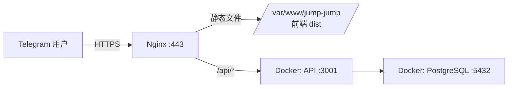

# 🚀 Jump Jump 部署指南

## 概览



---

## 前置条件

- ✅ 域名 `jump.garden` 已解析到服务器 `161.33.197.216`
- ✅ 前端已构建：`client/dist/` (index.html + assets/)
- ✅ 你有 Telegram Bot Token

---

## Step 1: 准备环境变量

在你本地编辑 `.env.production` 文件，填入真实值：

```bash
# 编辑这个文件
vim /Users/siyi/Documents/code/jump_jump/.env.production
```

```env
BOT_TOKEN=123456:ABC-DEF...         # 从 @BotFather 获取
JWT_SECRET=随便一个长随机字符串        # 可用: openssl rand -hex 32
POSTGRES_PASSWORD=安全的数据库密码     # 可用: openssl rand -hex 16
DOMAIN=jump.garden
```

生成随机密钥的快捷命令：
```bash
echo "JWT_SECRET=$(openssl rand -hex 32)"
echo "POSTGRES_PASSWORD=$(openssl rand -hex 16)"
```

---

## Step 2: 上传项目到服务器

```bash
# 从本地上传到服务器
rsync -avz --exclude='node_modules' --exclude='.git' \
  /Users/siyi/Documents/code/jump_jump/ \
  root@161.33.197.216:/opt/jump-jump/
```

> [!TIP]
> 如果你习惯用其他方式（scp / git clone），只要把整个 `jump_jump` 目录放到服务器 `/opt/jump-jump/` 即可。

---

## Step 3: 服务器初始化

SSH 登录服务器后执行：

```bash
ssh root@161.33.197.216
```

### 3.1 安装 Docker（如果没有）

```bash
curl -fsSL https://get.docker.com | sh
systemctl enable docker && systemctl start docker
```

### 3.2 安装 Nginx + Certbot

```bash
# Ubuntu/Debian
apt update && apt install -y nginx certbot python3-certbot-nginx

# 启动 nginx
systemctl enable nginx && systemctl start nginx
```

### 3.3 部署前端静态文件

```bash
mkdir -p /var/www/jump-jump
cp -r /opt/jump-jump/client/dist/* /var/www/jump-jump/
```

### 3.4 配置 Nginx

```bash
# 复制配置
cp /opt/jump-jump/nginx.conf /etc/nginx/sites-available/jump-jump
ln -sf /etc/nginx/sites-available/jump-jump /etc/nginx/sites-enabled/
rm -f /etc/nginx/sites-enabled/default

# 测试配置（先注释掉 SSL 部分，等证书拿到再启用）
nginx -t
```

> [!IMPORTANT]
> 第一次需要先拿 SSL 证书，暂时注释掉 `nginx.conf` 中 443 server block 的 `ssl_certificate` 两行，只保留 80 端口的配置。

---

## Step 4: 获取 SSL 证书

```bash
# 确保 80 端口 nginx 在运行
systemctl reload nginx

# 申请证书
certbot certonly --webroot -w /var/www/certbot -d jump.garden --email your@email.com --agree-tos --no-eff-email

# 或用 nginx 插件（更简单）
certbot --nginx -d jump.garden --email your@email.com --agree-tos --no-eff-email
```

证书拿到后，取消注释 `nginx.conf` 中的 SSL 配置，然后：

```bash
nginx -t && systemctl reload nginx
```

自动续期：
```bash
# certbot 自带 timer，确认已启用
systemctl enable certbot.timer
```

---

## Step 5: 启动后端服务

```bash
cd /opt/jump-jump

# 复制环境变量
cp .env.production .env

# 启动 PostgreSQL + API（Docker Compose）
docker compose up -d --build

# 查看状态
docker compose ps
docker compose logs -f api
```

### 5.1 运行数据库迁移

```bash
# 在 API 容器内运行迁移
docker compose exec api npx tsx src/db/migrate.ts
```

### 5.2 验证

```bash
# 健康检查
curl http://localhost:3001/health
# 应返回: {"status":"ok","timestamp":"..."}

# 通过 nginx 测试
curl https://jump.garden/health
# 应返回同样的结果

# 测试前端
curl -I https://jump.garden/
# 应返回 200 + text/html
```

---

## Step 6: 配置 Telegram Mini App

在 Telegram 中找 **@BotFather**，发送以下命令：

```
/mybots
→ 选择你的 Bot
→ Bot Settings
→ Menu Button
→ Configure menu button
```

设置：
- **Menu button URL**: `https://jump.garden`
- **Menu button text**: `🎮 Play Jump Jump`

或者用 `/newapp` 命令注册为 Mini App：
```
/newapp
→ 选择你的 Bot
→ Web App URL: https://jump.garden
→ Short name: jumpjump
```

---

## ✅ 验证清单

| 检查项 | 命令/方法 |
|--------|-----------|
| 域名解析 | `nslookup jump.garden` → 161.33.197.216 |
| HTTPS 生效 | 浏览器打开 `https://jump.garden` → 游戏开始页 |
| API 可访问 | `curl https://jump.garden/health` → `{"status":"ok"}` |
| 数据库连通 | `docker compose logs api` → 无连接错误 |
| TG Mini App | 在 Telegram 打开你的 Bot → 点菜单按钮 → 游戏加载 |
| 排行榜 | 玩一局后 → 排行榜有数据 |
| 分享 | 游戏结束 → 点分享 → 可发送到聊天 |

---

## 🔧 常用运维命令

```bash
# 查看日志
docker compose logs -f api
docker compose logs -f postgres

# 重启服务
docker compose restart api

# 更新代码后重新部署
cd /opt/jump-jump
git pull  # 或 rsync 上传
docker compose up -d --build           # 重建 API
cp -r client/dist/* /var/www/jump-jump/  # 更新前端

# 数据库备份
docker compose exec postgres pg_dump -U postgres jumpjump > backup_$(date +%Y%m%d).sql
```

---

> [!WARNING]
> 记得把 `.env` 和 `.env.production` 中的 `BOT_TOKEN` 保密，不要提交到 Git！建议在项目根目录添加 `.gitignore`：
> ```
> .env
> .env.production
> node_modules/
> client/dist/
> ```
